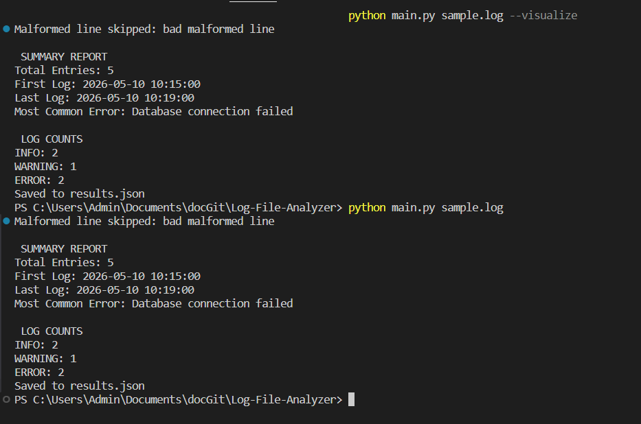
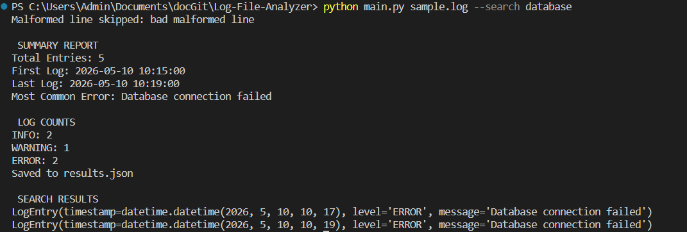
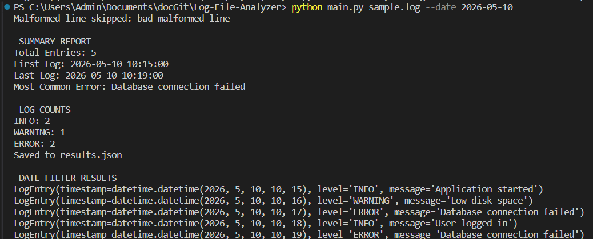
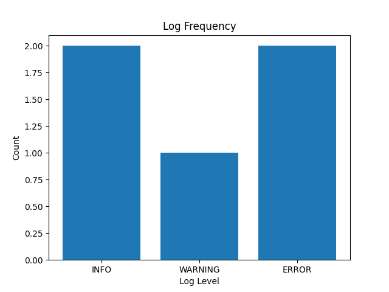
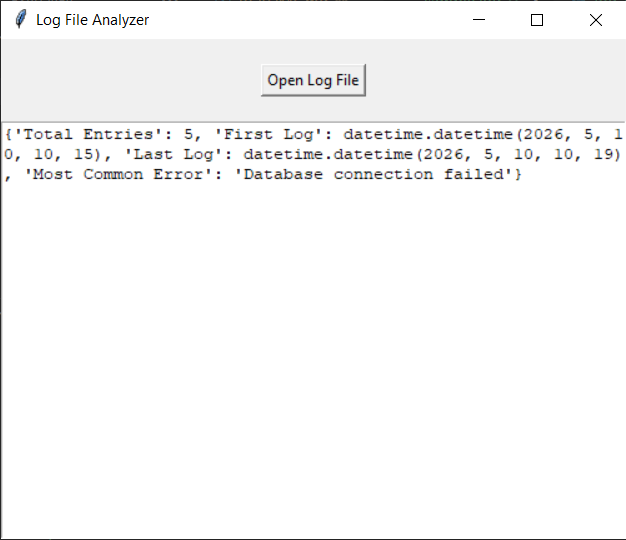

# Log File Analyzer

A Python OOP application for parsing and analyzing `.log` files.  
The application extracts log information, generates summaries, exports data to JSON, supports filtering/searching, and visualizes log statistics.


# Features

- Parse `.log` files using Regular Expressions
- Support for:
  - INFO
  - WARNING
  - ERROR
- Count logs by type
- Export parsed logs to JSON
- Search logs by keyword
- Filter logs by date
- Generate summary reports
- Visualize log statistics using Matplotlib
- Command Line Interface (CLI)
- Graphical User Interface (GUI)
- Handle malformed log lines


# Technologies Used

- Python 
- OOP (Object-Oriented Programming)
- Regex
- JSON
- Matplotlib
- Tkinter


# Project Structure

```text
Log-File-Analyzer/
│
├── screenshots/
│
├── main.py
├── log_analyzer.py
├── log_entry.py
├── gui.py
├── sample.log
├── results.json
├── requirements.txt
├── README.md
└── .gitignore
```


# Installation

## Clone Repository

```bash
git clone https://github.com/signora-misteriosa/Log-File-Analyzer.git
```

## Open Project Folder

```bash
cd Log-File-Analyzer
```

## Install Dependencies

```bash
pip install -r requirements.txt
```


# Sample Log Format

```text
2026-05-10 10:15:00 [INFO] Application started
2026-05-10 10:16:00 [WARNING] Low disk space
2026-05-10 10:17:00 [ERROR] Database connection failed
```


# Running the Application

## Basic Analysis

```bash
python main.py sample.log
```


## Search by Keyword

```bash
python main.py sample.log --search database
```


## Filter by Date

```bash
python main.py sample.log --date 2026-05-10
```


## Visualization

```bash
python main.py sample.log --visualize
```

This opens a matplotlib chart showing log frequency by type.


# GUI Version

Run:

```bash
python gui.py
```

Features:
- Open `.log` files
- View summary report
- Simple graphical interface


# Example Output

```text
SUMMARY REPORT
Total Entries: 5
First Log: 2026-05-10 10:15:00
Last Log: 2026-05-10 10:19:00
Most Common Error: Database connection failed

LOG COUNTS
INFO: 2
ERROR: 2
WARNING: 1
```


# Error Handling

The application automatically skips malformed lines.

Example:

```text
Malformed line skipped: bad malformed line
```


# Screenshots

## CLI Summary



---

## Search Function



---

## Date Filter



---

## Visualization Chart



---

## GUI Application



---


# OOP Design

The project follows Object-Oriented Programming principles:

- `LogEntry` class
  - Represents a single log entry

- `LogAnalyzer` class
  - Handles parsing
  - Filtering
  - Reporting
  - Visualization


# Future Improvements

- Support for additional log levels
- Advanced GUI features
- Timeline visualizations
- Export reports to CSV/PDF
- Real-time log monitoring


# Author

Eligia Raileanu
